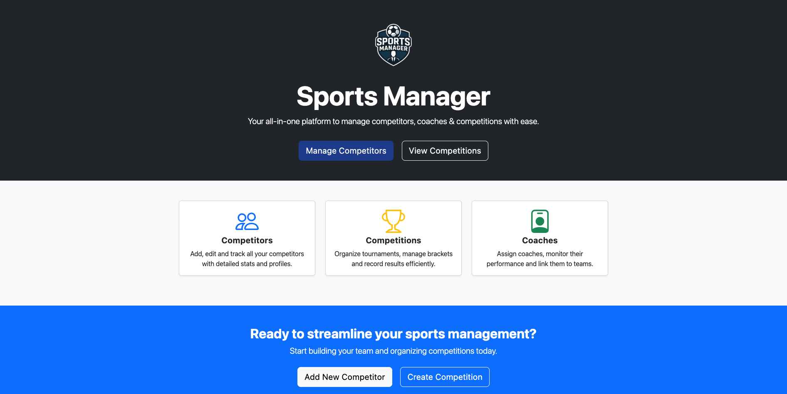
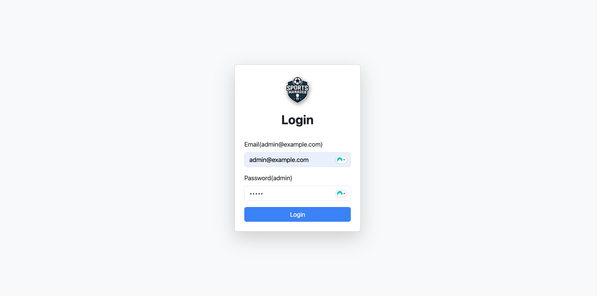
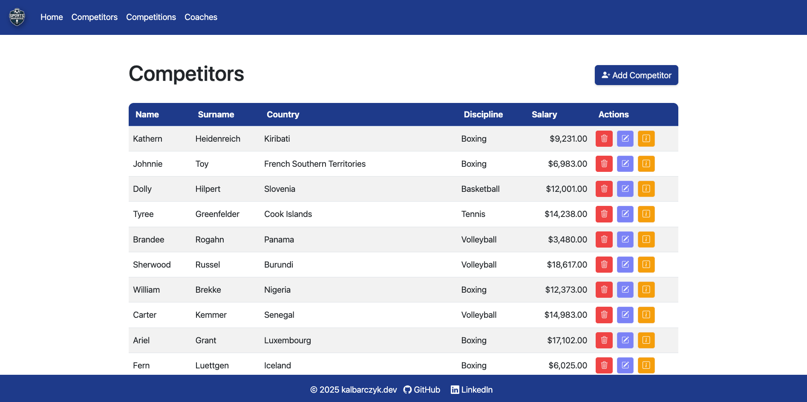
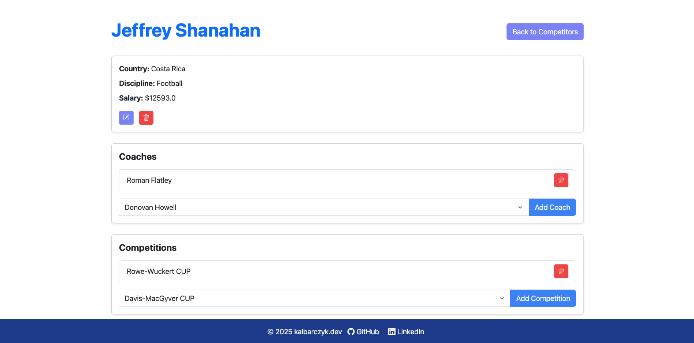
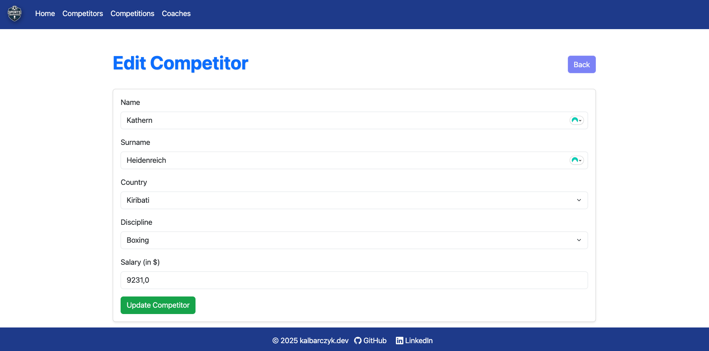

# Sports Manager

This is a portfolio application originally created for the  
**Information Systems Modeling (MAS)** course at the **Polish-Japanese Academy of Information Technology (PJATK)**.
You can view the original version of the code before the _"migrate to Spring Boot"_ commit.

Sports Manager is a **CRUD application** designed to simulate a real-world system that could be used
by organizations like the **International Olympic Committee (IOC)** to manage competitors, competitions, and coaches
assigned to competitors.

## Table of Contents

- [Requirements](#requirements)
- [Installation/Running](#installationrunning)
- [Usage](#usage)
- [Documentation](#documentation)
    - [UI](#ui)
    - [Diagrams](#diagrams)
- [Contributing](#contributing)
- [License](#license)

## Requirements

- Java 21+
- Maven 3.6+
- MySQL database server

## Installation/Running

* Clone the repository:

```bash
git clone https://github.com/KalbarczykDev/sports-manager
```

* Configure the database connection in `src/main/resources/application.yaml`:

```yaml 
spring:
  datasource:
    url: jdbc:mysql://localhost:3306/sports_manager?createDatabaseIfNotExist=True
    username: root
    password: yourPassword 
```

* Apply flyway migrations

```bash
./mvnw flyway:migrate
```

* Run application using maven

```bash
./mvnw spring-boot:run
  ```

## Usage

- Start the application and open: `http://localhost:8080` in your favourite browser.

- By default, the application will generate sample data you can change it in `application.yaml`

 ````yaml
sportsmanager:
  seeder:
    count: 100
````

### Example Workflows

**Add a Competitor**

- Navigate to the "Competitors" section (`/competitors`).
- Click **Add Competitor** and fill in Name, Surname, Country, Discipline, and Salary.
- Click **Save** to persist the competitor in the database.

**Assign a Coach to a Competitor**

- Open a competitor’s detail page (`/competitors/{id}`).
- Select an available coach from the **Add Coach** dropdown.
- Click **Add Coach**.
- The coach will appear in the competitor’s **Coaches** list. Already assigned coaches are excluded from the dropdown.

**Assign a Competition to a Competitor**

- Open a competitor’s detail page (`/competitors/{id}`).
- Select an available competition from the **Add Competition** dropdown.
- Click **Add Competition**.
- The competition will appear in the competitor’s **Competitions** list. Already assigned competitions are excluded.

**Remove a Coach or Competition**

- On a competitor’s detail page, click the **Remove** button next to listed coach or competition.
- The selected relation is removed from the competitor.

**Delete Coach, Competitor or Competition**

- Navigate to the list view (`/coaches`, `/competitors` or `/competitions`).
- Click the **Delete** button next to an entity.
- Confirm deletion in the modal.
- The entity is permanently removed from the system.

## Documentation

### UI

* Home View

  

* Login View

  

* Entity List View

  

* Entity Details View

  

* Entity Form View

  

### Diagrams

* Entity-Relation Diagram

  

* Class Diagram

  

## Contributing

This is a portfolio project, so I do not expect external pull requests.
However, if you spot any bugs or have ideas for improvements, feel free to open an issue or reach out.

## License

[MIT](LICENSE)
