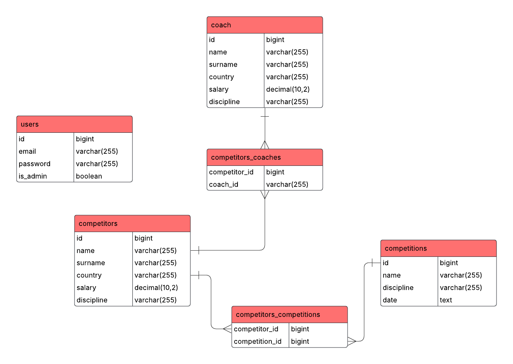
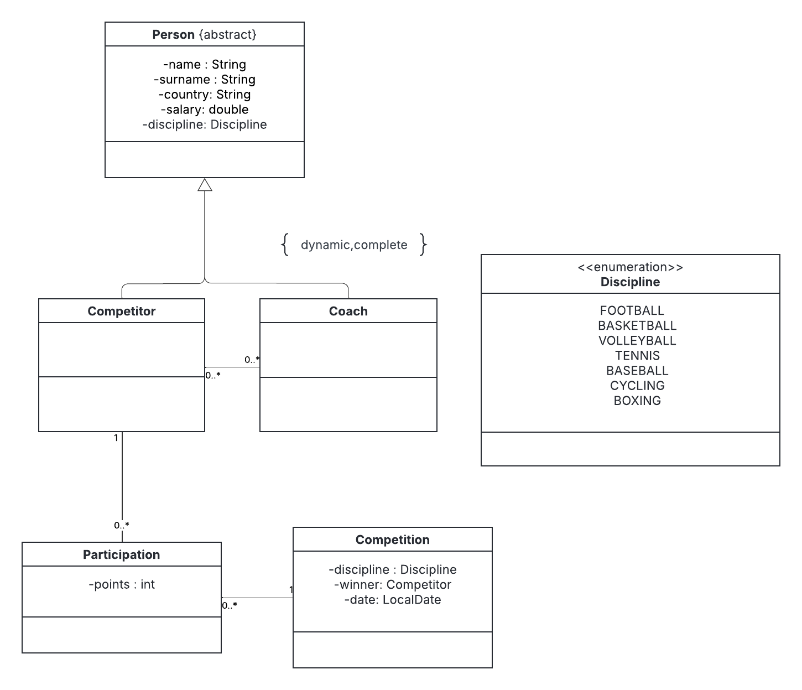

# Sports Manager

This is a portfolio application originally created for the  
**Information Systems Modeling (MAS)** course at the **Polish-Japanese Academy of Information Technology (PJATK)**.
You can view the original version of the code before the _"migrate to Spring Boot"_ commit.

Sports Manager is a **CRUD application** designed to simulate a real-world system that could be used
by organizations like the **International Olympic Committee (IOC)** to manage competitors, competitions, and coaches
assigned to competitors.

## Requirements

- Java 21+
- Maven 3.6+
- MySQL database server

## Installation/Running

* Clone the repository:

```bash
git clone https://github.com/KalbarczykDev/sports-manager
```

* Configure the database connection in `src/main/resources/application.yaml`:

```yaml 
spring:
  datasource:
    url: jdbc:mysql://localhost:3306/sports_manager?createDatabaseIfNotExist=True
    username: root
    password: yourPassword 
```

* Apply flyway migrations

* Run application using maven

```bash
./mvnw spring-boot:run
  ```

## Usage

- Start the application and open: `http://localhost:8080` in your favourite browser.

- By default, the application will generate sample data you can change it in `application.yaml`

 ````yaml
sportsmanager:
  seeder:
    count: 100
````

### Example Workflows

* **Add a Competitor**

- Navigate to the "Competitors" section.
- Click **Add Competitor** and fill in details such as name, age, and assigned coach.
- Save to persist the competitor in the database.

* **Schedule a Competition**

- Go to the "Competitions" section.
- Create a new competition by selecting date, location, and type.
- Assign registered competitors.

* **Assign a Coach**

- In the "Coaches" section, create a coach profile.
- Link a coach to one or multiple competitors.

## Documentation

### Entity-Relation Diagram



### Class Diagram



## Contributing

This is a portfolio project, so I do not expect external pull requests.
However, if you spot any bugs or have ideas for improvements, feel free to open an issue or reach out.

## License

[MIT](https://choosealicense.com/licenses/mit/)